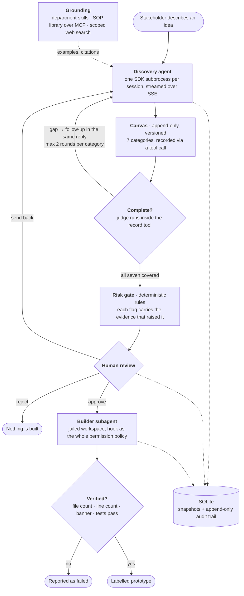

# Blueprint AI

A non-technical stakeholder describes an idea in plain language. An agent runs a structured
discovery conversation, a human reviews the compiled spec, and only then does a second agent
scaffold a small, clearly-labelled prototype.

Built on the [Claude Agent SDK](https://docs.claude.com/en/api/agent-sdk/overview). Everything
in it is synthetic — the SOP documents, the department profiles, the example conversations. It
is a portfolio project, not a product.


---

## The idea

Most "describe your use case" forms produce specs nobody can build from, because the person
filling them in doesn't know which details matter. The interesting part isn't generating text —
it's **running a good interview**, knowing when an answer is thin, and refusing to build until
a human has looked.

So the shape is deliberately not "one prompt, one answer":

| | |
|---|---|
| **Fixed** | Seven canvas categories, always covered, in order. A rule-based risk gate. A human approval step. |
| **Adaptive** | Which follow-up to ask, which examples to offer, which SOP to look up, what the prototype should contain. |

That split — a deterministic backbone with model latitude inside each step — is the whole
design. Collapsing it in either direction gives you a form or a chatbot.

## The canvas

Seven categories, every conversation, no skipping: **key stakeholders**, **key activities**,
**value proposition**, **system integrations**, **input source**, **input types**,
**output format**. Adapted from a discovery canvas I built and got adopted across 8+ teams in a
previous role; the version here is rewritten from scratch with synthetic content.

---

## How it works



### The pipeline, step by step

1. **Discovery** — one SDK subprocess per session, streaming over SSE. The model records
   answers by calling a tool, not by writing prose, so the canvas is structured state rather
   than something parsed back out of text.
2. **Classification** — once the stakeholder has described their process, a structured-output
   pass picks 1–3 department skills. Those supply the concrete examples the agent offers when
   asked "what's an example of a system integration?"
3. **Grounding** — a small MCP server over stdio exposes synthetic SOP documents with
   IDF-weighted keyword search. Optional web search is limited to a `.gov` allowlist and capped
   per session by a `PreToolUse` hook.
4. **Completeness** — after each capture, a judge scores the summary against that category's
   rubric. It runs *inside* the record tool, so a detected gap becomes a follow-up question in
   the same reply. Two clarification rounds per category, then it moves on and flags the gap.
5. **Review** — the compiled spec carries risk flags with the evidence that triggered each one.
   A named system integration always reaches "extra scrutiny". The reviewer approves, rejects,
   or sends it back, which reaches the stakeholder as the agent asking in its own voice.
6. **Build** — a Builder subagent writes into a jailed workspace. A `PreToolUse` hook is the
   entire permission policy; Python verifies file count, line count, the "illustrative
   prototype" banner, and that the tests pass, before anyone sees the result.

### Three surfaces, by construction

| Surface | Who | Sees |
|---|---|---|
| `/` and `/s/<id>` | Stakeholder | The conversation. No categories, no risk, no classifier output |
| `/review` | Reviewer (authenticated) | The compiled spec, risk flags with evidence, approve / send back / reject |
| `/admin` | Admin (authenticated) | Full trace, audit trail, build controls, eval results |

These are three route groups whose **responses are built from different data**, not one API
with a role flag. `SessionStatus` has no field for a risk level, so a requester cannot be shown
one by mistake.


---

## Running it

Needs Python 3.12+, [uv](https://docs.astral.sh/uv/), and Node 20+.

```bash
uv sync
cp .env.example .env          # add ANTHROPIC_API_KEY
```

**The conversation, in a terminal** — the fastest way to see the pipeline:

```bash
uv run python cli.py chat
```

**The full stack.** Two terminals:

```bash
uv run uvicorn blueprint.api:app_from_env --factory --port 8000
```

```bash
cd frontend && npm install && npm run add-user -- you admin "Your Name" && npm run dev
```

Then <http://localhost:3000>. `add-user` also generates the session secret; without an account,
`/review` and `/admin` refuse every request rather than falling open.

> **Do not run uvicorn with `--reload`.** It runs the app in a `multiprocessing` spawn child,
> and on Windows the SDK cannot start its CLI subprocess from there. Every session create fails
> with an empty `CLIConnectionError`.

**Other commands:**

```bash
uv run python cli.py review runs/<id>.json --send-back --note "Which HRIS?" --reviewer you
uv run python cli.py build runs/<id>.json
uv run python cli.py migrate                      # runs/*.json -> SQLite + audit trail
uv run python evals/risk_gate/run.py              # free, deterministic
uv run python evals/completeness/run.py --dry-run # cost estimate first
```

---

## Evals

Reference-based, with human-authored labels as the judge. Every case carries a `note` with its
labelling rationale, so a disagreement is settled by reading rather than by whoever edits the
file last.

| Suite | Cases | Headline metric | Result |
|---|---|---|---|
| [`risk_gate`](evals/risk_gate) | 18 | **scrutiny false negatives** | 0, 100% exact flag match, $0.00 |
| [`completeness`](evals/completeness) | 21 × 3 models | **missed gap rate** | 0.0% for all three; they separate on over-flagging |
| [`skill_matching`](evals/skill_matching) | 20 × 2 models | exact match | Opus 95.0%, Sonnet 91.7% |

Each headline was chosen by **what the failure costs**, not by what was easy to compute. A risk
false positive costs a reviewer thirty seconds; a false negative is an unreviewed build.

Two things the evals found that reading the code had not:

- Three risk rules had **recall 0.00** — they had never fired for anyone. `writes_to_system`
  matched a hand-written list of system nouns that had drifted until 74 of the systems the
  department skills name were invisible to it, while `named_integration` matched them all. They
  survived because the second flag reached the same risk level and covered for them.
- **Haiku 4.5 was not cheaper** on the completeness checker — same cost as Opus for 3.5× the
  latency, with a p95 of 24.7s inside a tool call. "Smaller model, lower cost" was the
  assumption the benchmark existed to test, and it was wrong here.

---

## What I'd want a reviewer to look at

- **[`blueprint/builder.py`](blueprint/builder.py)** — a `PreToolUse` hook as the *entire*
  permission policy: workspace jail, command allowlist, parent agent denied. Plus Python-side
  verification of what the model wrote, because the model reporting success is not evidence.
- **[`blueprint/review.py`](blueprint/review.py)** — risk as deterministic rules that carry the
  evidence that triggered them, so a reviewer can disagree with a specific quote.
- **[`blueprint/isolation.py`](blueprint/isolation.py)** and
  [`tests/test_isolation.py`](tests/test_isolation.py) — a three-line module and a test that
  source-scans every `ClaudeAgentOptions(` in the package. A stakeholder's agent must never see
  developer context, and that is enforced structurally rather than by habit.
- **[`frontend/proxy.ts`](frontend/proxy.ts)** — one gate for every protected route, failing
  closed, so a new admin route is protected by existing rather than by someone remembering.
- **[`docs/LEARNING_LOG.md`](docs/LEARNING_LOG.md)** — the decisions, with the options
  considered, and the mistakes kept rather than cleaned up.

[`docs/DEMO.md`](docs/DEMO.md) is a three-minute walkthrough, written to be recorded from
and readable on its own.


---

## Honest limits

This is a portfolio project and the gaps are deliberate rather than hidden:

- **Four departments** (HR, Finance, Sales, Customer Success) chosen as illustrative. Not
  department coverage.
- **One output-format template.** The Builder handles a Q&A stub; anything else is refused with
  a clear message rather than built badly.
- **Two of the four eval measures are missing** — end-to-end discovery completeness and a
  rubric-scored judge against gold specs. Both need a stakeholder simulator, which is about
  $6–8 per run, so it is a decision rather than a default.
- **Redaction is a filter, not a guarantee.** It catches identifiers with a mechanical shape and
  leaves prose alone; a regex chasing names would either miss most of them or shred the
  conversation. It has never run on real text containing an identifier outside a test.
- **Auth has no rate limiting** and sessions cannot be revoked short of rotating the secret.
- **The requester view has no automated tests.** The backend has 434; the React has a type
  checker and a linter. Every UI bug in this project was found by clicking.

---

## Stack

Python 3.12 · Claude Agent SDK · FastAPI · SQLite · MCP · Next.js 16 · TypeScript · Tailwind ·
ruff · mypy `--strict` · pytest · pre-commit with gitleaks · GitHub Actions

**434 tests.** ~5.9k lines of backend, ~4.6k of tests, ~2.5k of frontend. Twelve recorded
conversations cost $1.08 in total; a full discovery runs about $0.15 and a build about $0.46.

Model access is Claude via the Anthropic API, with an Amazon Bedrock path documented in
`.env.example` and **not yet exercised**.
