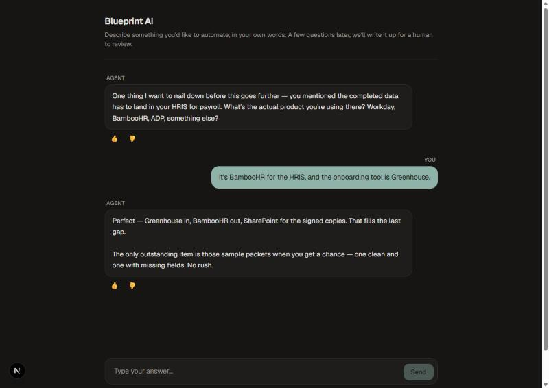
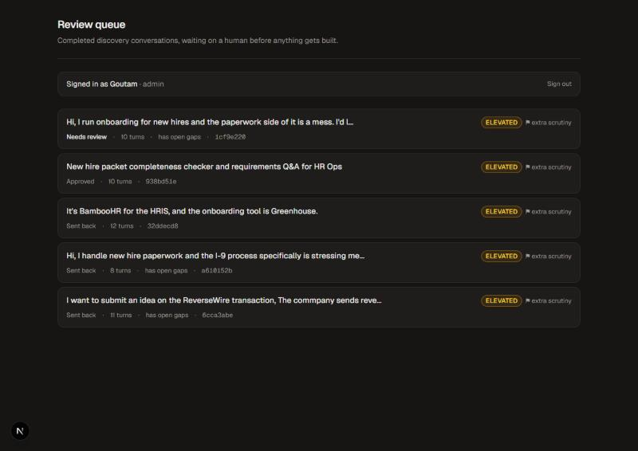
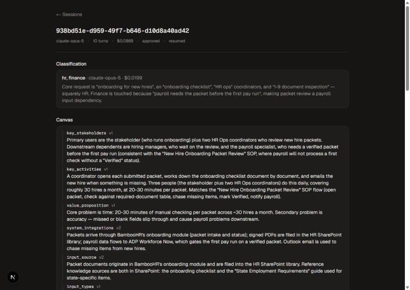

# AI Use-Case Intake

**Turn vague "can AI do this?" requests into reviewed, buildable specs.**

A stakeholder describes an idea in their own words. An agent runs a structured discovery
interview, adapting its questions to what they actually say. A human reviews the compiled spec
with risk flags attached. Only then does a second agent scaffold a small, clearly-labelled
prototype.

Built on the [Claude Agent SDK](https://docs.claude.com/en/api/agent-sdk/overview).



---

## Who this is for

If you run an AI programme, you have a version of this problem:

- A queue of requests that all say some form of *"can AI do our X?"*
- Most of them too vague to estimate, let alone build
- A few of them genuinely risky — they touch a system of record, or personal data — and you
  find that out late
- No consistent record of what was asked, what was decided, or why

The usual fix is an intake form, which fails for a specific reason: **the person filling it in
doesn't know which details matter.** They write "automate onboarding" because nobody asked them
how many people do it today, how often, or what happens downstream when it's late.

This replaces the form with an interview that knows what to ask, and puts a human gate in front
of anything getting built.

## What it does

**Seven categories, every conversation, no skipping** — stakeholders, activities, value,
system integrations, input source, input types, output format. What varies is *how* it asks:
which follow-up, which examples to offer, which internal document to look up.

That split is the design. Fixed backbone, model latitude inside each step. Collapse it in
either direction and you have a form or a chatbot.

**It notices thin answers.** Say "just the HR team" and it asks who's waiting downstream —
because a judge scored that answer against the category's rubric *inside* the same tool call
that recorded it, so the gap and the follow-up land in the same reply.

**It flags risk with evidence.** A named system integration always reaches "extra scrutiny",
and the flag quotes the phrase that raised it, so a reviewer can disagree with something
specific rather than with a score.

**Nothing gets built without a human.** Approve, reject, or send back. A send-back reaches the
stakeholder as the agent asking in its own voice — they never see the reviewer's words.

**Three surfaces, by construction:**

| Surface | Who | Sees |
|---|---|---|
| `/` and `/s/<id>` | Stakeholder | The conversation. No categories, no risk level, no classifier output |
| `/review` | Reviewer | The compiled spec, risk flags with evidence, approve / send back / reject |
| `/admin` | Admin | Full trace, audit trail, build controls, eval results |

These are three route groups whose responses are built from different data, not one API with a
role flag. The requester's status model has no field for a risk level, so they cannot be shown
one by mistake.



---

## How it works


1. **Discovery** — one SDK subprocess per session, streaming over SSE. The model records
   answers by calling a tool, so the canvas is structured state rather than prose parsed back
   out of text.
2. **Classification** — a structured-output pass picks 1–3 department profiles, which supply
   the concrete examples the agent offers when asked "what's an example of a system
   integration?"
3. **Grounding** — an MCP server over stdio exposes your SOP documents with IDF-weighted
   keyword search. Optional web search is limited to an allowlist and capped per session by a
   `PreToolUse` hook.
4. **Completeness** — a rubric judge per category, two clarification rounds, then it moves on
   and flags the gap for the reviewer rather than nagging.
5. **Review** — compiled spec, risk flags with evidence, decision recorded against the
   authenticated account in an append-only audit trail.
6. **Build** — a Builder subagent writes into a jailed workspace. A `PreToolUse` hook is the
   entire permission policy; Python verifies file count, line count, the "illustrative
   prototype" banner, and that the tests pass before anyone sees the result.

---

## Adapting it to your organisation

Everything domain-specific is data, not code:

| What | Where | Notes |
|---|---|---|
| Department profiles | `skills/<name>/SKILL.md` | Markdown with classification hints and per-category examples. Four ship as examples; add your own and the classifier picks them up. |
| Internal documents | `sop_docs/*.md` | Plain markdown. Served over MCP with keyword search — swap the server for your real document store. |
| What counts as a complete answer | `CATEGORY_RUBRIC` in `blueprint/canvas.py` | The elements a judge looks for per category. This is the file to argue about first. |
| Risk rules | `blueprint/review.py` | Deterministic, with the evidence attached. Named-system detection derives from your skill files. |
| Prototype templates | `builder_skills/<format>/SKILL.md` | One ships (a Q&A stub). Anything else is refused with a clear message rather than built badly. |

**Everything in this repo is synthetic** — the SOP documents, the department profiles, the
example conversations. There is no real company data in it, and none of it assumes yours looks
like the examples.

---

## Running it

Python 3.12+, [uv](https://docs.astral.sh/uv/), Node 20+.

```bash
uv sync
cp .env.example .env          # add ANTHROPIC_API_KEY
```

The conversation alone, in a terminal — the fastest way to see the pipeline:

```bash
uv run python cli.py chat
```

The full stack, in two terminals:

```bash
uv run uvicorn blueprint.api:app_from_env --factory --port 8000
```

```bash
cd frontend && npm install && npm run add-user -- you admin "Your Name" && npm run dev
```

Then <http://localhost:3000>. `add-user` also generates the session secret; without an account,
`/review` and `/admin` refuse every request rather than falling open.

> **Do not run uvicorn with `--reload`.** It runs the app in a `multiprocessing` spawn child,
> and on Windows the SDK cannot start its CLI subprocess from there.

Other commands:

```bash
uv run python cli.py review runs/<id>.json --send-back --note "Which HRIS?" --reviewer you
uv run python cli.py build runs/<id>.json
uv run python cli.py migrate                      # runs/*.json -> SQLite + audit trail
uv run python evals/risk_gate/run.py              # free, deterministic
uv run python evals/completeness/run.py --dry-run # cost estimate first
```

**Cost:** about **$0.15** per discovery conversation and **$0.46** per prototype build. Twelve
recorded conversations cost $1.08 in total.

**Capacity:** each live conversation holds an SDK subprocess at ~226 MB measured, so one 8 GB
host carries roughly 33 concurrent conversations — about 100 an hour with the default 15-minute
idle timeout. Registered users are unlimited; it's *concurrent* conversations that are bounded.
See [Current scope](#current-scope) on running more than one worker.

---

## Evals

Reference-based, with human-authored labels as the judge. Every case carries a `note` with its
labelling rationale, so a disagreement is settled by reading rather than by whoever edits the
file last.

| Suite | Cases | Headline metric | Result |
|---|---|---|---|
| [`risk_gate`](evals/risk_gate) | 18 | **scrutiny false negatives** | 0, 100% exact flag match, $0.00 |
| [`completeness`](evals/completeness) | 21 × 3 models | **missed gap rate** | 0.0% for all three; they separate on over-flagging |
| [`skill_matching`](evals/skill_matching) | 20 × 2 models | exact match | Opus 95.0%, Sonnet 91.7% |

Each headline was chosen by what the failure costs. A risk false positive costs a reviewer
thirty seconds; a false negative is an unreviewed build.

Two things the evals caught that reading the code had not:

- Three risk rules had **recall 0.00** — they had never fired for anyone. `writes_to_system`
  matched a hand-written list of system nouns that had drifted until 74 of the systems the
  department profiles name were invisible to it. They survived because a second flag reached
  the same risk level and covered for them.
- **Haiku 4.5 was not cheaper** on the completeness checker — same cost as Opus for 3.5× the
  latency, with a p95 of 24.7s inside a tool call. "Smaller model, lower cost" was the
  assumption the benchmark existed to test.

---

## Current scope

What it does not do yet, stated plainly so you can judge fit:

- **Single worker.** The session registry is in-process, so a second uvicorn worker would route
  a follow-up to a process that has never heard of that session. The SDK's `resume=` support
  makes stateless turns the natural fix; it is not built.
- **No rate limiting on sign-in**, and sessions last 12 hours with no revocation short of
  rotating the secret.
- **One prototype template** (a Q&A stub). Other output formats are refused with a clear
  message rather than built badly.
- **Four example department profiles** — illustrative, not coverage.
- **Two of four planned eval measures are missing** — end-to-end discovery completeness, and a
  rubric-scored judge against gold specs. Both need a simulated stakeholder, roughly $6–8 a run.
- **Redaction is a filter, not a guarantee.** It removes identifiers with a mechanical shape
  (emails, phone numbers, account numbers) and leaves prose alone; it has not been run against
  real text containing one.
- **No automated tests on the requester UI.** The backend has 434.
- **Amazon Bedrock is documented but unexercised** — every run has gone over the Anthropic API.

Deployment today means one host, behind HTTPS, with secrets from a real store. It is not
multi-tenant.



---

## Worth reading

- **[`blueprint/builder.py`](blueprint/builder.py)** — a `PreToolUse` hook as the *entire*
  permission policy: workspace jail, command allowlist, parent agent denied. Plus Python-side
  verification, because a model reporting success is not evidence.
- **[`blueprint/review.py`](blueprint/review.py)** — risk as deterministic rules that carry the
  evidence that triggered them.
- **[`blueprint/isolation.py`](blueprint/isolation.py)** and
  [`tests/test_isolation.py`](tests/test_isolation.py) — a three-line module and a test that
  source-scans every `ClaudeAgentOptions(` in the package. A stakeholder's agent must never see
  developer context, enforced structurally rather than by habit.
- **[`frontend/proxy.ts`](frontend/proxy.ts)** — one gate for every protected route, failing
  closed.
- **[`docs/LEARNING_LOG.md`](docs/LEARNING_LOG.md)** — every design decision with the options
  considered, and the mistakes kept rather than cleaned up.
- **[`docs/DEMO.md`](docs/DEMO.md)** — a three-minute walkthrough.

## Stack

Python 3.12 · Claude Agent SDK · FastAPI · SQLite · MCP · Next.js 16 · TypeScript · Tailwind ·
ruff · mypy `--strict` · pytest · pre-commit with gitleaks · GitHub Actions

434 tests. ~5.9k lines of backend, ~4.6k of tests, ~2.5k of frontend, ~0.9k of evals.
